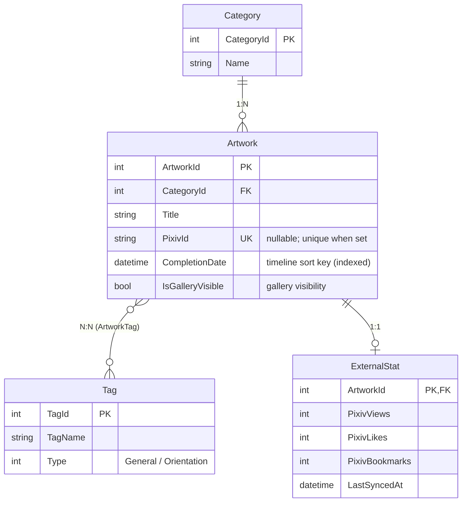
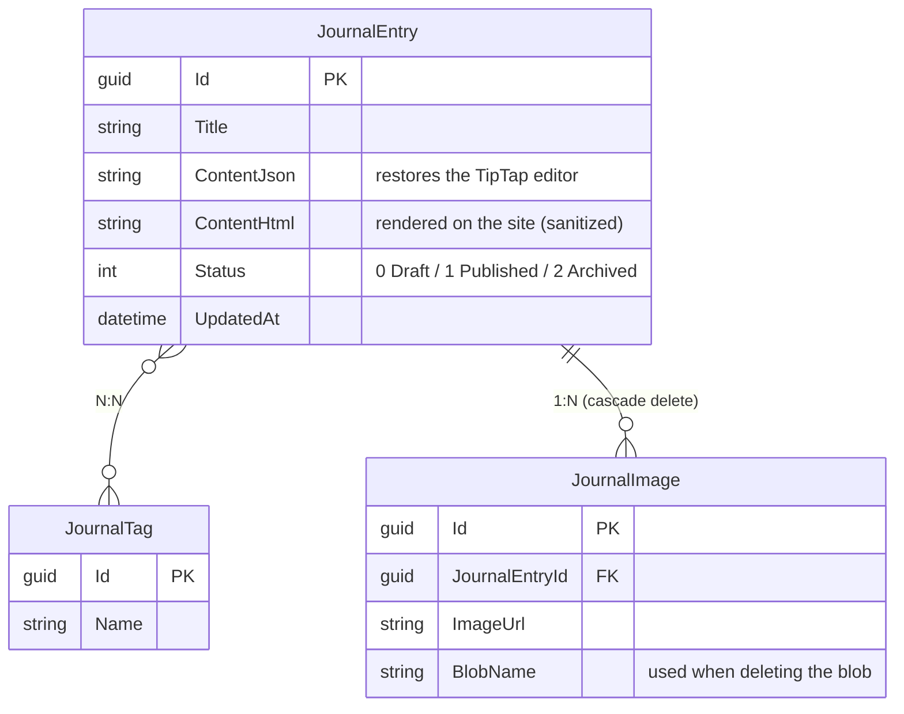

# MyPortfolio Backend

ASP.NET Core Web API backend for a personal portfolio website.

The project adopts a **Frontend/Backend Separation** architecture. It provides RESTful APIs for artwork management, journal management, and administrator authentication. Images are processed automatically before being uploaded to Azure Blob Storage, while authentication is handled using Google OAuth with JWT Cookie authentication.

[中文版 README](./README.zh.md)

## Why did I build this project?

This project combines my passion for drawing with my background in computer science: I wanted to practice .NET development while showcasing the progress I have made over the past few years. My drawing has never improved quickly, but every one of those past artworks is an asset of my growth — and this website itself is a milestone of my growth as a developer.

Through this project I walked through a complete backend development journey: from layered architecture (Controller–Service–Repository), dependency injection, and an EF Core Code-First database, through the ASP.NET Core middleware pipeline, all the way to cloud deployment.

---

# Tech Stack

| Technology                  | Purpose                                  |
| --------------------------- | ---------------------------------------- |
| ASP.NET Core Web API        | RESTful API                              |
| Entity Framework Core 10    | ORM / Code First                         |
| SQLite                      | Development Database                     |
| Google OAuth                | Administrator Login                      |
| JWT + Cookie Authentication | Authentication & Authorization           |
| Azure Blob Storage          | Cloud Image Storage                      |
| SkiaSharp                   | Image Compression / Thumbnail Generation |
| HtmlSanitizer               | HTML Sanitization (XSS Protection)       |
| Serilog                     | Logging                                  |
| Scalar (OpenAPI)            | API Documentation                        |
| Rate Limiting               | Fixed-window throttling (per client IP)  |
| xUnit                       | Unit / Integration Testing               |

---

# Features

## Authentication

- Google OAuth administrator login
- Google account whitelist validation
- JWT generation after successful login
- Store JWT inside `AppAuth` HttpOnly Cookie
- Cookie authentication for administrator APIs
- Automatic login status validation
- Cookie renewal within expiration period
- Secure logout

---

## Artwork Management

- CRUD operations for artworks
- Upload artwork using multipart/form-data
- Automatic image validation
- Convert uploaded images into WebP format
- Generate thumbnail automatically
- Upload processed images to Azure Blob Storage
- Delete cloud files together with database records
- Artwork category support
- Multi-tag support
- Pixiv statistics model reserved

---

## Journal Management

- Rich text editor (Tiptap) support
- Store both JSON and rendered HTML
- Automatic HTML sanitization
- Draft system
- Publish workflow
- Journal image upload
- Automatic orphan image cleanup
- Journal tags
- Azure Blob Storage integration

---

## Logging

- Global exception logging
- Request logging
- Physical log files generated by Serilog

---

# Project Structure

```text
├── Controllers
│   ├── BaseApiController.cs      # Unified API response wrapper
│   ├── AuthController.cs
│   ├── ArtworkController.cs
│   ├── CategoryController.cs
│   └── JournalController.cs
│
├── Migrations                    # Entity Framework Core Migrations
│
├── Common                        # Cross-layer shared types
│   ├── ApiResponse.cs            # HTTP response envelope
│   └── ServiceResult.cs          # Service-layer result wrapper
│
├── Data
│   └── DbContext.cs              # EF Core DbContext (data access infrastructure)
│
├── DTOs                          # API contracts, split per module
│   ├── ArtworkDtos.cs
│   ├── AuthDtos.cs
│   ├── CategoryDtos.cs
│   └── JournalDtos.cs
│
├── Model
│   └── Entities                  # EF Core entities (domain model)
│
├── Repository                    # Database access layer
│   ├── ArtworkRepository.cs
│   └── JournalRepository.cs
│
├── Services                       # Business logic
│   ├── ArtworkService.cs
│   ├── AuthService.cs
│   ├── BlobService.cs             # Azure Blob Storage operations (singleton)
│   ├── CategoryService.cs
│   ├── JournalService.cs
│   └── Interfaces
│
├── Utility
│   └── ImageValidator.cs
│
├── MyPortfolio.Tests              # xUnit test project
│   ├── Repository                 # SQLite in-memory integration tests
│   ├── Service
│   ├── Utility
│   └── TestHelpers
│
├── Keys                           # JWT / Data Protection keys (gitignored)
├── wwwroot                        # Static files (legacy; uploads now stored in Azure Blob)
│
├── MyPortfolio.db
└── Program.cs
```

---

# Architecture

```
HTTP Request
      │
      ▼
Controller
      │
      ▼
Service
      │
      ▼
Repository
      │
      ▼
Entity Framework Core
      │
      ▼
SQLite
```

Responsibilities

- **Controller**
  - Receive HTTP requests
  - Validate input
  - Return unified API responses through `BaseApiController`

- **Service**
  - Handle business logic
  - Authentication
  - Image processing
  - HTML sanitization
  - Blob storage operations through the `IBlobService` abstraction (registered as singleton)

- **Repository**
  - Database query abstraction
  - CRUD operations

---

# API Response Format

Every endpoint returns a unified response format.

```json
{
  "success": true,
  "statusCode": 200,
  "message": "Operation completed successfully.",
  "data": {}
}
```

Error example

```json
{
  "success": false,
  "statusCode": 404,
  "message": "Artwork not found.",
  "data": null
}
```

---

# API Endpoints

## Authentication

Base Route

```
/api/auth
```

| Method | Endpoint        | Permission      | Description                                       |
| ------ | --------------- | --------------- | ------------------------------------------------- |
| POST   | `/google-login` | Public          | Validate Google ID Token and issue AppAuth Cookie |
| GET    | `/status`       | Cookie Required | Check login status and auto renew cookie          |
| POST   | `/logout`       | Public          | Remove authentication cookie                      |

---

## Artwork

Base Route

```
/api/artworks
```

| Method | Endpoint | Permission | Description                     |
| ------ | -------- | ---------- | ------------------------------- |
| GET    | `/`      | Public     | Get published artworks          |
| GET    | `/{id}`  | Public     | Get artwork details             |
| POST   | `/`      | Admin      | Upload artwork                  |
| PUT    | `/{id}`  | Admin      | Update artwork                  |
| DELETE | `/{id}`  | Admin      | Delete artwork and Azure images |

---

## Category

Base Route

```
/api/category
```

| Method | Endpoint | Permission | Description        |
| ------ | -------- | ---------- | ------------------- |
| GET    | `/`      | Public     | Get all categories  |

---

## Journal

Base Route

```
/api/journal
```

| Method | Endpoint      | Permission | Description            |
| ------ | ------------- | ---------- | ---------------------- |
| GET    | `/`           | Public     | Get published journals |
| GET    | `/draft`      | Admin      | Retrieve draft         |
| POST   | `/draft`      | Admin      | Save draft             |
| POST   | `/publish`    | Admin      | Publish journal        |
| DELETE | `/{id}`       | Admin      | Delete journal         |
| POST   | `/image`      | Admin      | Upload journal image   |
| DELETE | `/image/{id}` | Admin      | Delete journal image   |

---

# Database Design

## Artwork Module

- Artwork
- Category
- Tag
- ExternalStat

### Relationships



---

## Journal Module

- JournalEntry
- JournalTag
- JournalImage

### Relationships



---

# Security

- Google OAuth authentication
- Google account whitelist validation
- JWT authentication
- HttpOnly Cookie
- HTML Sanitizer against XSS attacks
- Three-layer image upload validation: extension allowlist → magic-number content detection → SkiaSharp re-encoding to WebP (strips potentially malicious payloads)
- Authorization Policy (`AdminOnly`)
- Centralized exception handling
- Structured logging with Serilog
- Fixed-window rate limiting (100 requests / 15 minutes per client IP)
- Hardened response headers (COOP, X-Content-Type-Options, Referrer-Policy, Permissions-Policy, X-Frame-Options)
- Origin allowlist re-check on authenticated write requests (POST/PUT/DELETE/PATCH)
- Forwarded headers support behind Azure's reverse proxy

---

# Image Upload Flow

```
Upload Image
      │
      ▼
ImageValidator
      │
      ▼
SkiaSharp
(WebP Compression)
      │
      ▼
Generate Thumbnail
      │
      ▼
Azure Blob Storage
      │
      ▼
Save URL into Database
```

---

# Configuration

The application uses `appsettings.json` for local development and Azure App Service **Application Settings** for production deployment.

## Local Development

Create an `appsettings.Development.json` (or modify `appsettings.json`) and configure the following values.

```json
{
  "Serilog": {
    "Using": [
      "Serilog.Sinks.Console",
      "Serilog.Sinks.File",
      "Serilog.Sinks.Seq",
      "Serilog.Enrichers.Environment",
      "Serilog.Enrichers.Thread"
    ],
    "MinimumLevel": {
      "Default": "Information",
      "Override": {
        "Microsoft": "Warning",
        "Microsoft.AspNetCore": "Warning"
      }
    },
    "WriteTo": [
      { "Name": "Console" },
      {
        "Name": "File",
        "Args": {
          "Path": "logs/myapp-.txt",
          "rollingInterval": "Day",
          "retainedFileCountLimit": 30
        }
      },
      { "Name": "Seq", "Args": { "serverUrl": "your Seq server url" } }
    ],
    "Enrich": ["FromLogContext", "WithMachineName", "WithThreadId"]
  },
  "AllowedHosts": "*",
  "ConnectionStrings": {
    "DefaultConnection": "Data Source=MyPortfolio.db;"
  },

  "Jwt": {
    "Issuer": "Your Backend Issuer",
    "Audience": "Your Frontend Audience",
    "Secret": "YourSuperSecretJwtKeyAtLeast32bits"
  },

  "BlobStorage": {
    "ConnectionString": "Your Azure Blob Storage Connection String",
    "ContainerName": "Your Container Name"
  },

  "AllowedOrigins": ["https://localhost:5173"],

  "Authentication": {
    "Google": {
      "ClientId": "Your Google OAuth Client ID"
    }
  },

  "Admin": {
    "Email": "YourEmail@example.com"
  }
}
```

### Configuration Description

| Key                                   | Description                                                           |
| ------------------------------------- | --------------------------------------------------------------------- |
| `ConnectionStrings:DefaultConnection` | SQLite database connection string                                     |
| `Jwt:Issuer`                          | JWT issuer                                                            |
| `Jwt:Audience`                        | Allowed frontend origin                                               |
| `Jwt:Secret`                          | Secret key used to sign JWT tokens (recommend at least 32 characters) |
| `BlobStorage:ConnectionString`        | Azure Blob Storage connection string                                  |
| `BlobStorage:ContainerName`           | Blob Storage container name                                           |
| `AllowedOrigins`                      | Array of allowed CORS origins; required at startup or the app throws  |
| `Authentication:Google:ClientId`      | Google OAuth Client ID used to validate the ID Token audience         |
| `Admin:Email`                         | Administrator Google account whitelist                                |

---

# Local Startup

Restore packages

```bash
dotnet restore
```

Apply database migration

```bash
dotnet ef database update
```

Run the project

```bash
dotnet run
```

The API will be available at

```text
https://localhost:7098
```

> Note: migrations are also applied automatically on startup (`Database.Migrate()` in `Program.cs`), so `dotnet ef database update` is optional for local runs.

---

# Testing

Run the test suite:

```bash
dotnet test MyPortfolio.Tests
```

Testing strategy:

- **Pure logic** (e.g. `ImageValidator`) is unit-tested directly.
- **Repository layer** tests run against a real **SQLite in-memory** database instead of mocking `DbContext`, so EF Core query translation is actually verified.
- Every test gets a fresh, isolated database (xUnit creates a new test-class instance per `[Fact]`).

Current coverage:

- Image magic-number validation (format detection, disguised-file rejection, stream position reset)
- Cursor-based pagination (ordering, same-date tie-break, paging across pages, visibility filter)
- Journal tag get-or-create (dedup, case-insensitive matching, trimming)
- Category service (seed data retrieval, DTO mapping)

The CI pipeline runs the full test suite on every push to `main` before deploying.

---

# Azure Deployment

This project is deployed automatically through **GitHub Actions** whenever code is pushed to the `main` branch.

Deployment workflow:

```text
Push to main
      │
      ▼
GitHub Actions
      │
      ▼
dotnet restore
      │
      ▼
dotnet publish
      │
      ▼
Azure Login (OIDC)
      │
      ▼
dotnet test
      │
      ▼
Azure Web App
```

## Required GitHub Secrets

The following repository secrets must be configured before GitHub Actions can deploy successfully.

| Secret                  | Description                      |
| ----------------------- | -------------------------------- |
| `AZURE_CLIENT_ID`       | Azure App Registration Client ID |
| `AZURE_TENANT_ID`       | Azure Tenant ID                  |
| `AZURE_SUBSCRIPTION_ID` | Azure Subscription ID            |

---

## Azure App Service Application Settings

Production configuration should **NOT** be committed into the repository.

Instead, configure the following settings inside **Azure Portal → App Service → Environment Variables**.

| Key                                    | Default/Example Value           | Description                                                |
| :------------------------------------- | :------------------------------ | :--------------------------------------------------------- |
| `ConnectionStrings__DefaultConnection` | `Server=tcp:...`                | Production database connection string                      |
| `Jwt__Issuer`                          | `https://yourdomain.com`        | JWT issuer                                                 |
| `Jwt__Audience`                        | `https://frontend.com`          | Frontend domain                                            |
| `Jwt__Secret`                          | `your_super_secret_key_here...` | JWT signing secret                                         |
| `BlobStorage__ConnectionString`        | `DefaultEndpointsProtocol=...`  | Azure Blob Storage connection string                       |
| `BlobStorage__ContainerName`           | `uploads`                       | Blob Storage container                                     |
| `AllowedOrigins__0`                    | `https://yourdomain.com`        | Allowed CORS origin (index per entry)                      |
| `Authentication__Google__ClientId`     | `xxxx.apps.googleusercontent.com` | Google OAuth Client ID                                   |
| `Admin__Email`                         | `admin@gmail.com`               | Administrator Google account whitelist                     |
| `Serilog__Using__0`                    | `Serilog.Sinks.Console`         | Loads the Serilog Console sink package                     |
| `Serilog__MinimumLevel__Default`       | `Information`                   | Core log level (can be changed to Warning for production)  |
| `Serilog__WriteTo__0__Name`            | `Console`                       | Redirects logs to stdout/Console only (excluding Seq/File) |

> ASP.NET Core automatically maps environment variables using double underscores (`__`) to nested configuration sections.

---

## Deployment Trigger

Every push to the `main` branch automatically performs the following steps:

1. Restore NuGet packages
2. Build and publish the application
3. Authenticate to Azure using GitHub OIDC
4. Run the test suite
5. Deploy to Azure Web App (`YourWebAppName`)

---

## Deployment Notes (lessons learned)

- `dotnet publish` **must target `MyPortfolio.csproj` explicitly.** The repo root contains both a `.sln` and a `.csproj`; publishing without specifying the project resolves to the solution and bundles the test project into the same output folder, which prevents App Service (Linux) from detecting the startup assembly.
- The deploy step uses `clean: true` so stale files from previous deployments are removed from App Service. Keep this in mind if anything is ever stored on the App Service disk (uploads currently live in Azure Blob, so this is safe).

# Future Improvements

- Pixiv Status Tracking
- Tag System
- Refresh Token authentication
- Search and filtering APIs
- Redis cache
- Integration Testing (API-level)

---

# License

This project is for personal learning and portfolio demonstration purposes.
