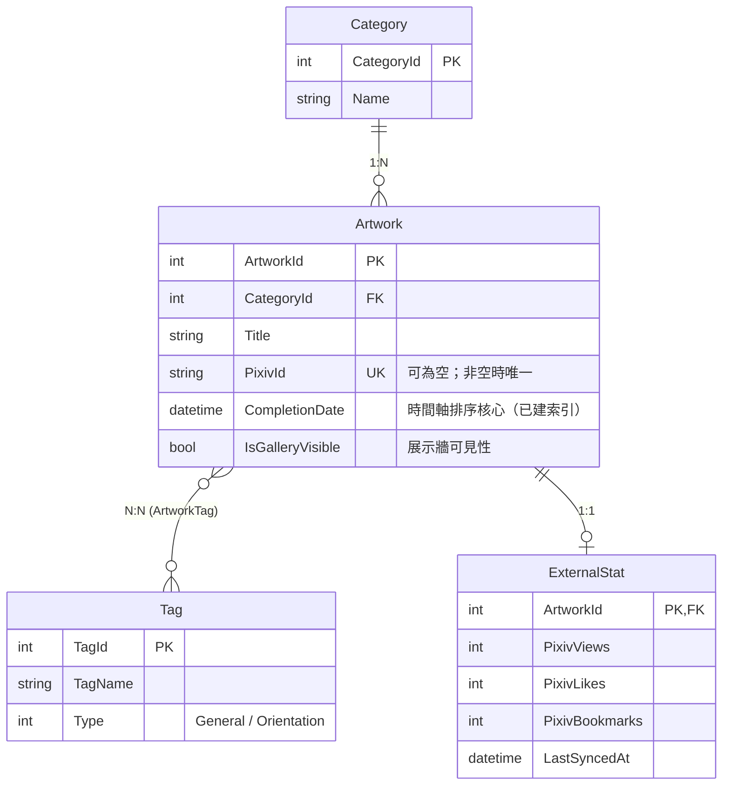
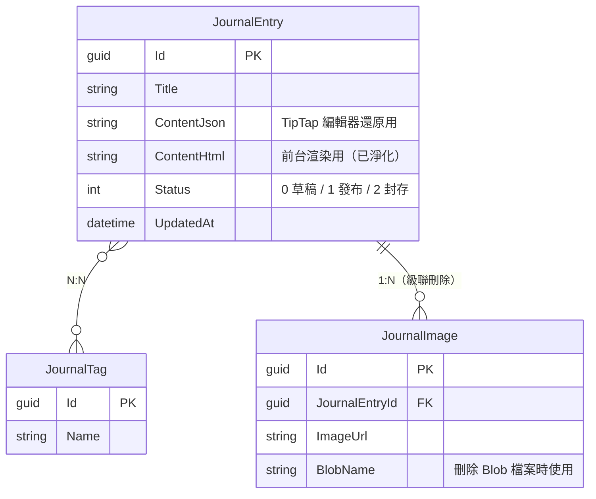

# MyPortfolio 後端

個人作品集網站的 ASP.NET Core Web API 後端。

本專案採用**前後端分離**架構。提供用於作品管理、日誌管理和管理員身分驗證的 RESTful API。圖片在上傳至 Azure Blob Storage 前會進行自動處理，身分驗證則採用 Google OAuth 結合 JWT Cookie 驗證機制。

[English README](./README.md)

## 為什麼開發本專案？

這個專案結合本人的繪畫興趣與資工專長，想在練習.NET程式設計時同時展示過去數年間的進步軌跡，雖然本人的繪畫進步並不迅速，但這些過去的畫作都是我成長的資產，而這個網站本身，也是我作為程式設計人員成長的路標。

透過這份專案，我完整走過了一次後端開發的歷程：從分層架構(Controller-Service-Repository)、依賴注入、EF Core的Code first資料庫以及ASP.NET Core 的中介軟體管線，一路到雲端部署。

---

# 技術堆疊

| 技術                     | 用途                            |
| ------------------------ | ------------------------------- |
| ASP.NET Core Web API     | RESTful API                     |
| Entity Framework Core 10 | ORM / 程式碼優先 (Code First)   |
| SQLite                   | 開發環境資料庫                  |
| Google OAuth             | 管理員登入                      |
| JWT + Cookie 驗證        | 身分驗證與授權                  |
| Azure Blob Storage       | 雲端圖片儲存                    |
| SkiaSharp                | 圖片壓縮 / 縮圖生成             |
| HtmlSanitizer            | HTML 淨化 (防範 XSS 攻擊)       |
| Serilog                  | 日誌記錄                        |
| Scalar (OpenAPI)         | API 文件                        |
| Rate Limiting            | 固定時間窗口限流（依客戶端 IP） |
| xUnit                    | 單元 / 整合測試                 |

---

# 功能特色

## 身分驗證

- Google OAuth 管理員登入
- Google 帳號白名單驗證
- 登入成功後生成 JWT
- 將 JWT 儲存於 `AppAuth` HttpOnly Cookie 中
- 管理員 API 的 Cookie 驗證
- 自動驗證登入狀態
- 過期時間內自動展延 Cookie
- 安全登出

---

## 作品管理

- 作品的 CRUD 操作
- 使用 `multipart/form-data` 上傳作品
- 自動圖片驗證
- 將上傳圖片轉換為 WebP 格式
- 自動生成縮圖
- 將處理後的圖片上傳至 Azure Blob Storage
- 刪除資料庫紀錄時同步刪除雲端檔案
- 支援作品分類
- 支援多標籤
- 預留 Pixiv 統計資料模型

---

## 日誌管理

- 支援富文本編輯器 (Tiptap)
- 同時儲存 JSON 與渲染後的 HTML
- 自動 HTML 淨化
- 草稿系統
- 發布工作流程
- 日誌圖片上傳
- 自動清理孤立無用的圖片
- 日誌標籤
- 整合 Azure Blob Storage

---

## 日誌記錄

- 全域例外狀況記錄
- 請求記錄
- 由 Serilog 生成實體日誌檔案

---

# 專案結構

```text
├── Controllers
│   ├── BaseApiController.cs      # 統一的 API 回應包裝
│   ├── AuthController.cs
│   ├── ArtworkController.cs
│   ├── CategoryController.cs
│   └── JournalController.cs
│
├── Migrations                    # Entity Framework Core 遷移紀錄
│
├── Common                        # 跨層共用型別
│   ├── ApiResponse.cs            # HTTP 回應信封
│   └── ServiceResult.cs          # Service 層回傳容器
│
├── Data
│   └── DbContext.cs              # EF Core DbContext（資料存取基礎設施）
│
├── DTOs                          # API 契約，按模組拆檔
│   ├── ArtworkDtos.cs
│   ├── AuthDtos.cs
│   ├── CategoryDtos.cs
│   └── JournalDtos.cs
│
├── Model
│   └── Entities                  # EF Core 實體（領域模型）
│
├── Repository                    # 資料庫存取層
│   ├── ArtworkRepository.cs
│   └── JournalRepository.cs
│
├── Services                      # 業務邏輯層
│   ├── ArtworkService.cs
│   ├── AuthService.cs
│   ├── BlobService.cs             # Azure Blob Storage 操作（singleton）
│   ├── CategoryService.cs
│   ├── JournalService.cs
│   └── Interfaces
│
├── Utility
│   └── ImageValidator.cs
│
├── MyPortfolio.Tests              # xUnit 測試專案
│   ├── Repository                 # SQLite in-memory 整合測試
│   ├── Service
│   ├── Utility
│   └── TestHelpers
│
├── Keys                           # JWT / Data Protection 金鑰（已加入 .gitignore）
├── wwwroot                        # 靜態檔案（舊版遺留；上傳圖片現已存放於 Azure Blob）
│
├── MyPortfolio.db
└── Program.cs

```

---

# 架構

```
HTTP 請求
      │
      ▼
Controller (控制器)
      │
      ▼
Service (服務層)
      │
      ▼
Repository (儲存庫層)
      │
      ▼
Entity Framework Core
      │
      ▼
SQLite

```

**職責分配**

- **Controller (控制器)**
- 接收 HTTP 請求
- 驗證輸入資料
- 透過 `BaseApiController` 回傳統一的 API 回應

- **Service (服務層)**
- 處理業務邏輯
- 身分驗證
- 圖片處理
- HTML 淨化
- 透過 `IBlobService` 抽象層（註冊為 singleton）操作 Blob 儲存

- **Repository (儲存庫層)**
- 資料庫查詢抽象化
- CRUD 操作

---

# API 回應格式

每個端點皆回傳統一的回應格式。

```json
{
  "success": true,
  "statusCode": 200,
  "message": "Operation completed successfully.",
  "data": {}
}
```

錯誤範例：

```json
{
  "success": false,
  "statusCode": 404,
  "message": "Artwork not found.",
  "data": null
}
```

---

# API 端點

## 身分驗證

基礎路由

```
/api/auth

```

| 方法 | 端點            | 權限           | 描述                                         |
| ---- | --------------- | -------------- | -------------------------------------------- |
| POST | `/google-login` | 公開           | 驗證 Google ID Token 並核發 `AppAuth` Cookie |
| GET  | `/status`       | 需 Cookie 驗證 | 檢查登入狀態並自動展延 Cookie                |
| POST | `/logout`       | 公開           | 移除身分驗證 Cookie                          |

---

## 作品

基礎路由

```
/api/artworks

```

| 方法   | 端點    | 權限   | 描述                      |
| ------ | ------- | ------ | ------------------------- |
| GET    | `/`     | 公開   | 取得已發布的作品          |
| GET    | `/{id}` | 公開   | 取得作品詳細資訊          |
| POST   | `/`     | 管理員 | 上傳作品                  |
| PUT    | `/{id}` | 管理員 | 更新作品                  |
| DELETE | `/{id}` | 管理員 | 刪除作品及 Azure 上的圖片 |

---

## 分類

基礎路由

```
/api/category

```

| 方法 | 端點 | 權限 | 描述         |
| ---- | ---- | ---- | ------------ |
| GET  | `/`  | 公開 | 取得所有分類 |

---

## 日誌

基礎路由

```
/api/journal

```

| 方法   | 端點          | 權限   | 描述             |
| ------ | ------------- | ------ | ---------------- |
| GET    | `/`           | 公開   | 取得已發布的日誌 |
| GET    | `/draft`      | 管理員 | 取得草稿         |
| POST   | `/draft`      | 管理員 | 儲存草稿         |
| POST   | `/publish`    | 管理員 | 發布日誌         |
| DELETE | `/{id}`       | 管理員 | 刪除日誌         |
| POST   | `/image`      | 管理員 | 上傳日誌圖片     |
| DELETE | `/image/{id}` | 管理員 | 刪除日誌圖片     |

---

# 資料庫設計

## 作品模組

- Artwork (作品)
- Category (分類)
- Tag (標籤)
- ExternalStat (外部統計)

### 關聯



---

## 日誌模組

- JournalEntry (日誌項目)
- JournalTag (日誌標籤)
- JournalImage (日誌圖片)

### 關聯



---

# 安全性

- Google OAuth 身分驗證
- Google 帳號白名單驗證
- JWT 身分驗證
- HttpOnly Cookie
- 使用 HTML Sanitizer 防範 XSS 攻擊
- 圖片上傳三層驗證：副檔名白名單 → magic number 內容檢測 → SkiaSharp 重新編碼為 WebP（去除潛在惡意 payload）
- 授權原則 (`AdminOnly`)
- 集中式例外狀況處理
- 使用 Serilog 進行結構化日誌記錄
- 固定時間窗口限流（每個客戶端 IP 15 分鐘內最多 100 次請求）
- 強化回應標頭（COOP、X-Content-Type-Options、Referrer-Policy、Permissions-Policy、X-Frame-Options）
- 已登入使用者對 POST/PUT/DELETE/PATCH 請求的 Origin 白名單二次驗證
- 支援 Azure 反向代理的 Forwarded Headers

---

# 圖片上傳流程

```
上傳圖片
      │
      ▼
ImageValidator (圖片驗證)
      │
      ▼
SkiaSharp
(WebP 壓縮)
      │
      ▼
生成縮圖
      │
      ▼
Azure Blob Storage
      │
      ▼
將 URL 儲存至資料庫

```

---

# 設定

應用程式在本地端開發使用 `appsettings.json`，而在正式環境部署時使用 Azure App Service 的**應用程式設定 (Application Settings)**。

## 本地端開發

建立 `appsettings.Development.json`（或修改 `appsettings.json`）並設定以下數值。

```json
{
  "Serilog": {
    "Using": [
      "Serilog.Sinks.Console",
      "Serilog.Sinks.File",
      "Serilog.Sinks.Seq",
      "Serilog.Enrichers.Environment",
      "Serilog.Enrichers.Thread"
    ],
    "MinimumLevel": {
      "Default": "Information",
      "Override": {
        "Microsoft": "Warning",
        "Microsoft.AspNetCore": "Warning"
      }
    },
    "WriteTo": [
      { "Name": "Console" },
      {
        "Name": "File",
        "Args": {
          "Path": "logs/myapp-.txt",
          "rollingInterval": "Day",
          "retainedFileCountLimit": 30
        }
      },
      { "Name": "Seq", "Args": { "serverUrl": "你的 seq server url" } }
    ],
    "Enrich": ["FromLogContext", "WithMachineName", "WithThreadId"]
  },
  "AllowedHosts": "*",
  "ConnectionStrings": {
    "DefaultConnection": "Data Source=MyPortfolio.db;"
  },

  "Jwt": {
    "Issuer": "你的後端發行者",
    "Audience": "你的前端受眾",
    "Secret": "你的超級秘密JWT密鑰至少需32字元"
  },

  "BlobStorage": {
    "ConnectionString": "你的 Azure Blob Storage 連線字串",
    "ContainerName": "你的容器名稱"
  },

  "AllowedOrigins": ["https://localhost:5173"],

  "Authentication": {
    "Google": {
      "ClientId": "你的 Google OAuth Client ID"
    }
  },

  "Admin": {
    "Email": "YourEmail@example.com"
  }
}
```

### 設定說明

| 鍵值 (Key)                            | 描述                                                     |
| ------------------------------------- | -------------------------------------------------------- |
| `ConnectionStrings:DefaultConnection` | SQLite 資料庫連線字串                                    |
| `Jwt:Issuer`                          | JWT 發行者                                               |
| `Jwt:Audience`                        | 允許的前端來源 (Origin)                                  |
| `Jwt:Secret`                          | 用於簽署 JWT Token 的密鑰 (建議至少 32 個字元)           |
| `BlobStorage:ConnectionString`        | Azure Blob Storage 連線字串                              |
| `BlobStorage:ContainerName`           | Blob Storage 容器名稱                                    |
| `AllowedOrigins`                      | 允許的 CORS 來源陣列；未設定時應用程式啟動會直接拋出例外 |
| `Authentication:Google:ClientId`      | 用於驗證 Google ID Token Audience 的 OAuth Client ID     |
| `Admin:Email`                         | 管理員 Google 帳號白名單                                 |

---

# 本地端啟動

還原套件：

```bash
dotnet restore

```

套用資料庫遷移：

```bash
dotnet ef database update

```

執行專案：

```bash
dotnet run

```

API 服務將運行於：

```text
https://localhost:7098

```

> 備註：應用程式啟動時也會自動套用遷移（`Program.cs` 中的 `Database.Migrate()`），因此本地執行時 `dotnet ef database update` 並非必要步驟。

---

# 測試

執行測試套件：

```bash
dotnet test MyPortfolio.Tests
```

測試策略：

- **純邏輯**（如 `ImageValidator`）直接進行單元測試。
- **Repository 層**測試對著真實的 **SQLite in-memory** 資料庫執行，而非 mock `DbContext`——這樣才能真正驗證 EF Core 的查詢翻譯。
- 每個測試都擁有獨立的資料庫（xUnit 對每個 `[Fact]` 建立全新的測試類別實例），確保測試互不干擾。

目前涵蓋範圍：

- 圖片 magic number 驗證（格式判定、偽裝檔攔截、串流位置重置）
- Cursor-based 分頁（排序、同日期 tie-break、跨頁游標、可見性過濾）
- 日誌標籤 get-or-create（去重、大小寫不敏感比對、trim）
- 分類服務（種子資料讀取、DTO 映射）

CI 流程會在每次推送至 `main` 部署前自動執行完整測試套件。

---

# Azure 部署

每當程式碼推送至 `main` 分支時，本專案會透過 **GitHub Actions** 自動進行部署。

部署工作流程：

```text
推送至 main 分支
      │
      ▼
GitHub Actions
      │
      ▼
dotnet restore
      │
      ▼
dotnet publish
      │
      ▼
Azure 登入 (OIDC)
      │
      ▼
dotnet test
      │
      ▼
Azure Web App (應用程式服務)

```

## 必要的 GitHub Secrets

在 GitHub Actions 成功部署之前，必須先設定以下儲存庫機密 (Repository Secrets)。

| 機密變數 (Secret)       | 描述                        |
| ----------------------- | --------------------------- |
| `AZURE_CLIENT_ID`       | Azure 應用程式註冊用戶端 ID |
| `AZURE_TENANT_ID`       | Azure 租用戶 ID             |
| `AZURE_SUBSCRIPTION_ID` | Azure 訂用帳戶 ID           |

---

## Azure 應用程式服務設定

正式環境的設定**不應**提交至程式碼儲存庫中。

請改為在 **Azure Portal → App Service (應用程式服務) → Environment Variables (環境變數)** 中配置以下設定：

| 設定項目 (Key)                         | 預設/範例值 (Value)               | 描述                                       |
| :------------------------------------- | :-------------------------------- | :----------------------------------------- |
| `ConnectionStrings__DefaultConnection` | `Server=tcp:...`                  | 正式環境資料庫連線字串                     |
| `Jwt__Issuer`                          | `https://yourdomain.com`          | JWT 發行者                                 |
| `Jwt__Audience`                        | `https://frontend.com`            | 前端網域                                   |
| `Jwt__Secret`                          | `your_super_secret_key_here...`   | JWT 簽署密鑰                               |
| `BlobStorage__ConnectionString`        | `DefaultEndpointsProtocol=...`    | Azure Blob Storage 連線字串                |
| `BlobStorage__ContainerName`           | `uploads`                         | Blob Storage 容器名稱                      |
| `AllowedOrigins__0`                    | `https://yourdomain.com`          | 允許的 CORS 來源（每個來源一個索引）       |
| `Authentication__Google__ClientId`     | `xxxx.apps.googleusercontent.com` | Google OAuth Client ID                     |
| `Admin__Email`                         | `admin@gmail.com`                 | 管理員 Google 帳號白名單                   |
| `Serilog__Using__0`                    | `Serilog.Sinks.Console`           | 載入 Serilog 的 Console 輸出套件           |
| `Serilog__MinimumLevel__Default`       | `Information`                     | 核心日誌等級（正式環境可改為 `Warning`）   |
| `Serilog__WriteTo__0__Name`            | `Console`                         | 指定日誌僅輸出至主機控制台 (拔除 Seq/File) |

> 💡 **備註：** ASP.NET Core 會自動將使用雙底線 (`__`) 的環境變數對應到巢狀設定區塊中。

---

## 部署觸發條件

每次推送到 `main` 分支都會自動執行以下步驟：

1. 還原 NuGet 套件
2. 建置並發布應用程式
3. 使用 GitHub OIDC 驗證 Azure 身分
4. 執行測試套件
5. 部署至 Azure Web App (`YourWebAppName`)

---

## 部署備註（踩坑紀錄）

- `dotnet publish` **必須明確指定 `MyPortfolio.csproj`**。因為 repo 根目錄同時存在 `.sln` 與 `.csproj`，未指定專案時會解析到 solution，把測試專案一併發佈到同一個輸出資料夾，導致 App Service（Linux）無法辨識啟動組件。
- 部署步驟開啟了 `clean: true`，確保 App Service 上不殘留舊部署的檔案。若未來有任何資料存放在 App Service 磁碟上須特別留意（目前上傳圖片皆存於 Azure Blob，因此是安全的）。

---

# 未來改進方向

- Pixiv 狀態追蹤
- 標籤系統
- Refresh Token 身分驗證
- 搜尋與過濾 API
- Redis 快取
- 整合測試（API 層級）

---

# 授權條款

本專案僅供個人學習與作品集展示使用。
